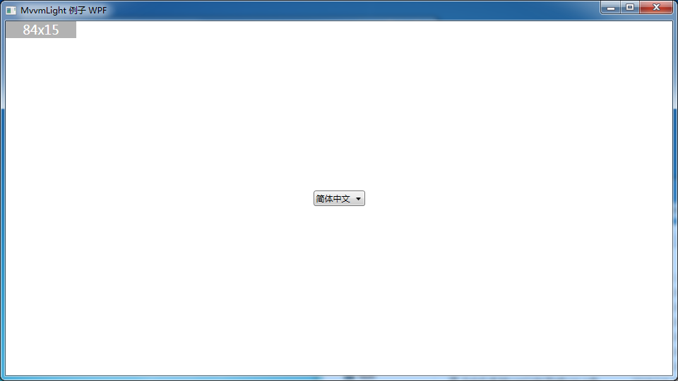

## MvvmLight Sample Wpf

---

### Git提交到远程Github的方法

* 创建`SSH Key`

  ``` bash
  $ ssh-keygen -t rsa -C "mail@addr.com"
  ```

* 验证是否连接到Github账户

  ``` bash
  $ ssh -T git@github.com
  ```

* 设置用户名和邮箱

  ``` bash
  $ git config --global user.name  "name" //你的GitHub登陆名
  $ git config --global user.email "123@126.com" //你的GitHub注册邮箱
  ```

* 建立本地仓库和远程仓库连接

  ``` bash
  $ git init
  $ git remote add origin git@github.com:KKKKKKi/MvvmLight-Sample.git
  $ git pull origin master
  $ git push -u origin master
  ```

* 提交

  ``` bash
  $ git add * // 新增文件
  $ git commit -m <message>
  $ git push origin master
  ```

---

### 应用截图

